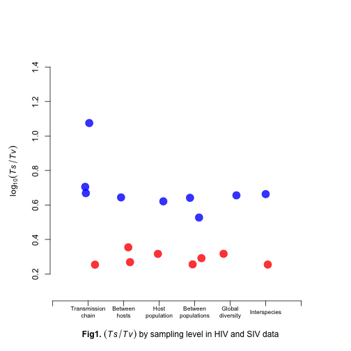
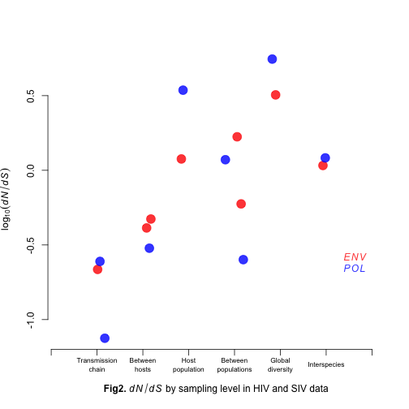
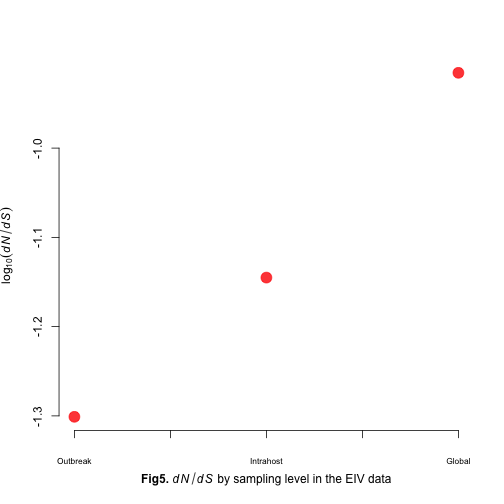

Ts/Tv in HIV/SIV and EIV
========================


HIV/EIV
=======

Load data

```r
hiv_dat <- read.table("hiv/models_hiv.txt", head = T, as.is = T)


hiv_dat$file <- toupper(hiv_dat$file)

cases.pol <- grepl("POL|GAG", hiv_dat$file)
cases.env <- grepl("ENV", hiv_dat$file)
scales <- sapply(hiv_dat$file, function(x) strsplit(x, "[.]")[[1]][1])

tr_ts <- (hiv_dat$Q2 + hiv_dat$Q5)/(hiv_dat$Q1 + hiv_dat$Q3 + hiv_dat$Q4 + hiv_dat$Q6)
hiv_dat <- cbind(hiv_dat, tr_ts)
```


Run plots with log10 transformation


```r

tr_ts_scale <- cbind(factor(scales), tr_ts)

par(mar = c(5, 5, 4, 4))
### Tr Ts ratio plot
plot(jitter(as.numeric(gsub("SC", "", scales))), log10(tr_ts), col = c(rgb(1, 
    0, 0, 0.8), rgb(0, 0, 1, 0.8))[cases.pol + 1], xlim = c(6.8, 0), pch = 20, 
    axes = F, ann = T, type = "p", ylab = expression(log[10](italic(Ts/Tv))), 
    xlab = expression(paste(bold("Fig1. "), (italic(Ts/Tv)), " by sampling level in HIV and SIV data")), 
    ylim = c(0.1, 1.5), cex = 3)

axis(1, lab = F)
axis(2)
text(axTicks(1), -0.02, labels = c("", "Transmission\nchain", "Between\nhosts", 
    "Host\npopulation", "Between\npopulations", "Global\ndiversity", "Interspecies", 
    ""), xpd = T, cex = 0.7)
legend(1, 2, legend = c(expression(italic(ENV)), expression(italic(POL))), text.col = c(rgb(1, 
    0, 0, 0.8), rgb(0, 0, 1, 0.8)), bty = "n")
```

 


```r
### KA Ks ratio plot
plot(jitter(as.numeric(gsub("SC", "", scales))), log10(hiv_dat$meanKaks), col = c(rgb(1, 
    0, 0, 0.8), rgb(0, 0, 1, 0.8))[cases.pol + 1], xlim = c(6.8, 0), pch = 20, 
    axes = F, ann = T, type = "p", ylab = expression(log[10](italic(dN/dS))), 
    xlab = expression(paste(bold("Fig2. "), italic(dN/dS), " by sampling level in HIV and SIV data")), 
    cex = 3)

axis(1, lab = F)
axis(2)
text(axTicks(1), -1.3, labels = c("", "Transmission\nchain", "Between\nhosts", 
    "Host\npopulation", "Between\npopulations", "Global\ndiversity", "Interspecies", 
    ""), xpd = T, cex = 0.7)
legend(1, -0.5, legend = c(expression(italic(ENV)), expression(italic(POL))), 
    text.col = c(rgb(1, 0, 0, 0.8), rgb(0, 0, 1, 0.8)), bty = "n")
```

 


```r
## TsTv dNdS plot
par(mar = c(6, 5, 5, 5))
plot(log10(hiv_dat$tr_ts), log10(hiv_dat$meanKaks), col = c(rgb(1, 0, 0, 0.8), 
    rgb(0, 0, 1, 0.8))[cases.pol + 1], , pch = 20, axes = F, ann = T, type = "p", 
    ylab = expression(log[10](italic(dN/dS))), xlab = expression(log[10](italic(Ts/Tv))), 
    ylim = c(-1.1, 0.6), xlim = c(0.1, 1.2), cex = 3)

axis(1)
axis(2)
mtext(expression(paste(bold("Fig 3. "), italic(dN/dS), " vs.", italic(Ts/Tv))), 
    side = 1, line = 4.5)

legend(1, -0.5, legend = c(expression(italic(ENV)), expression(italic(POL))), 
    text.col = c(rgb(1, 0, 0, 0.8), rgb(0, 0, 1, 0.8)), bty = "n")
```

 


EIV
====

Load EIV data


```r
eiv_dat <- read.table("EIV/models_hiv.txt", head = T)


tr_ts_eiv <- (eiv_dat$Q2 + eiv_dat$Q5)/(eiv_dat$Q1 + eiv_dat$Q3 + eiv_dat$Q4 + 
    eiv_dat$Q6)
eiv_dat <- cbind(eiv_dat, tr_ts_eiv)
eiv_dat <- eiv_dat[c(3, 2, 1), ]

print(eiv_dat)
```

```
##                       file   model logLik         I k   shape Q1     Q2 Q3
## 3    EIV.HA.Outbreak.fasta GTR+G+I  -1265 5.410e-05 4 499.994  1  8.128  1
## 2 EIV.HA.Intrahost-2.fasta GTR+G+I  -1578 5.684e-05 4 499.994  1  8.613  1
## 1    EIV.HA.Global-3.fasta GTR+G+I  -5710 3.161e-01 4   1.218  1 14.359  1
##   Q4     Q5 Q6    bf1    bf2    bf3    bf4 meanKaks varKaks minTime
## 3  1  8.128  1 0.3582 0.2015 0.2066 0.2336   0.0500 0.05000      NA
## 2  1  8.613  1 0.3536 0.2033 0.2115 0.2316   0.0716 0.04172    2001
## 1  1 14.359  1 0.3640 0.1879 0.2077 0.2403   0.1214 0.10492    1963
##   maxTime tr_ts_eiv
## 3      NA     4.064
## 2    2012     4.306
## 1    2008     7.179
```


Run similar plots to those for the previous data set


```r
par(mar = c(5, 5, 4, 4))
### Tr Ts ratio plot

plot(c(1, 2, 3), log10(eiv_dat$tr_ts), col = c(rgb(1, 0, 0, 0.8)), type = "p", 
    pch = 20, axes = F, ann = T, ylab = expression(log[10](italic(Ts/Tv))), 
    xlab = expression(paste(bold("Fig4. "), (italic(Ts/Tv)), " by sampling level in the EIV data")), 
    cex = 3)
axis(1, lab = F)
text(axTicks(1), 0.58, labels = c("Outbreak", "", "Intrahost", "", "Global"), 
    xpd = T, cex = 0.7)
axis(2)
```

 


```r
### Ka Ks ratio plot

plot(c(1, 2, 3), log10(eiv_dat$meanKaks), col = c(rgb(1, 0, 0, 0.8)), pch = 20, 
    axes = F, ann = T, type = "p", ylab = expression(log[10](italic(dN/dS))), 
    xlab = expression(paste(bold("Fig5. "), italic(dN/dS), " by sampling level in the EIV data")), 
    cex = 3)
axis(1, lab = F)
axis(2)
text(axTicks(1), -1.35, labels = c("Outbreak", "", "Intrahost", "", "Global"), 
    xpd = T, cex = 0.7)
```

 


 


```r
### TsTv dNdS plot

par(mar = c(6, 5, 5, 5))
plot(log10(eiv_dat$tr_ts), log10(eiv_dat$meanKaks), col = rgb(1, 0, 0, 0.8), 
    pch = 20, axes = F, ann = T, type = "p", ylab = expression(log[10](italic(dN/dS))), 
    xlab = expression(log[10](italic(Ts/Tv))), cex = 3)

axis(1)
axis(2)
mtext(expression(paste(bold("Fig 6. "), italic(dN/dS), " vs.", italic(Ts/Tv))), 
    side = 1, line = 4.5)
```

 


