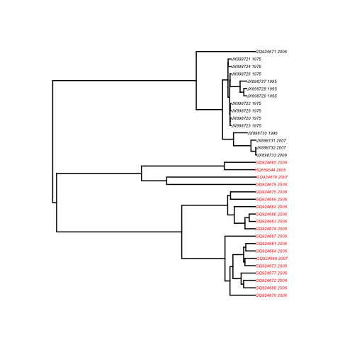
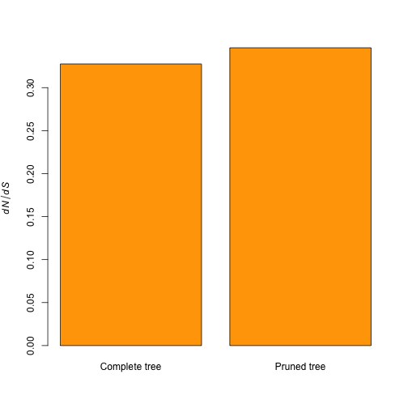
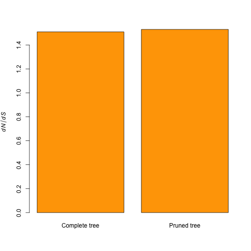

```r
library(ape)
library(phangorn)
library(NELSI)
library(seqinr)
```


```r
results.matrix <- matrix(NA, 1, 9)
colnames(results.matrix) <- c("virus_name", "root_complete", "root_reduced", 
    "titv_complete", "titv_reduced", "titv_boot", "kaks_complete", "kaks_reduced", 
    "kaks_boot")

get.trts <- function(dnabin, tree) {
    dat_temp <- phyDat(dnabin)
    dat_pml_init <- pml(tree, dat_temp)
    dat_pml <- optim.pml(dat_pml_init, optEdge = T)
    dat_opt <- optim.pml(dat_pml, optQ = T, optEdge = F)
    return((dat_opt$Q[2] + dat_opt$Q[5])/(dat_opt$Q[1] + dat_opt$Q[3] + dat_opt$Q[4] + 
        dat_opt$Q[6]))
}

boot.trts <- function(dnabin, tree, nsamps) {
    sample_tax <- sample(rownames(dnabin), nsamps)
    dnabin <- dnabin[!(rownames(dnabin) %in% sample_tax), ]
    tree_red <- drop.tip(tree, sample_tax)
    dat_red <- phyDat(dnabin)
    print("running boot")
    return(get.trts(dat_red, tree_red))
}

get.kaks <- function(dnabin) {
    while (ncol(dnabin)%%3 != 0) {
        print("the alignemnt is shorted than expected")
        dnabin <- dnabin[, 1:(ncol(dnabin) - 1)]
    }
    write.dna(dnabin, file = "alin_temp.fasta", format = "fasta", nbcol = -1, 
        colsep = "")
    dat_temp <- read.alignment("alin_temp.fasta", format = "fasta")
    system("rm alin_temp.fasta")
    kaks_temp <- kaks(dat_temp)
    kaks_temp <- as.vector(kaks_temp$ka)/as.vector(kaks_temp$ks)
    kaks_temp <- mean(kaks_temp[!(kaks_temp %in% c(Inf, NA, NaN)) & kaks_temp >= 
        0])
    return(kaks_temp)
}

boot.kaks <- function(dnabin, nsamps) {
    sample_tax <- sample(rownames(dnabin), nsamps)
    dat_red <- dnabin[!(rownames(dnabin) %in% sample_tax), ]
    print("running boot")
    return(get.kaks(dat_red))
}
```


```
#############
# Capripoxivirus

capox_remove <- c("FJ869362_1983", "FJ869358_1983", "FJ869390_1986", "FJ869355_1986", "FJ869359_1984", "FJ869356_1998", "FJ869357_1961", "FJ869376_1954", "FJ869374_2000", "FJ869371_2006", "FJ869369_2006", "FJ869370_2006", "FJ869375_2006", "FJ869373_2007", "FJ869372_2008", "FJ869367_1999", "FJ869377_1989", "FJ869390_1984")

capox_tree <- read.nexus("trees_Capox.xml.tre")
plot(capox_tree, tip.color = (capox_tree$tip.label %in% capox_remove) + 1, edge.width = 2, cex = 0.5)

capox_data <- read.dna("Capox_N29.fasta", format = "fasta")

capox_tree_reduced <- drop.tip(capox_tree, capox_remove)
capox_data_reduced <- capox_data[!(rownames(capox_data) %in% capox_remove), ]

capox_trts <- get.trts(capox_data, capox_tree)
capox_trts_reduced <- get.trts(capox_data_reduced, capox_tree_reduced)
capox_trts_boot <- sum(sapply(1:3, function(x) capox_trts_reduced > boot.trts(capox_data, capox_tree, length(capox_remove))))
capox_kaks <- get.kaks(capox_data)
capox_kaks_reduced <- get.kaks(capox_data_reduced)
capox_kaks_boot <- sum(sapply(1:3, function(x) capox_kaks_reduced > boot.kaks(capox_data, length(capox_remove))))

results.matrix <- rbind(results.matrix, c("Capripoxivirus_dsDNA", max(allnode.times(capox_tree)), max(allnode.times(capox_tree_reduced)), capox_trts, capox_trts_reduced, capox_trts_boot, capox_kaks, capox_kaks_reduced, capox_kaks_boot))
```


```r
############ Hepatitis B virus

hbv_remove <- c("GQ924670_2006", "GQ924668_2006", "GQ924672_2006", "GQ924677_2006", 
    "GQ924673_2006", "GQ924680_2007", "GQ924664_2006", "GQ924661_2006", "GQ924667_2006", 
    "GQ924674_2006", "GQ924663_2006", "GQ924666_2006", "GQ924662_2006", "GQ924669_2006", 
    "GQ924675_2006", "GQ924679_2006", "GQ924676_2007", "HQ659544_2005", "GQ924665_2006")

hbv_tree <- read.nexus("trees_HBV_N42.xml.tre")
plot(hbv_tree, tip.color = (hbv_tree$tip.label %in% hbv_remove) + 1, edge.width = 2, 
    cex = 0.5)
```

 

```r

hbv_data <- read.dna("HBV_N42.fasta", format = "fasta")

hbv_tree_reduced <- drop.tip(hbv_tree, hbv_remove)
hbv_data_reduced <- hbv_data[!(rownames(hbv_data) %in% hbv_remove), ]
hbv_trts <- get.trts(hbv_data, hbv_tree)
```

```
## Warning: I unrooted the tree (rooted trees are not yet supported)
```

```
## optimize edge weights:  -55349 --> -4667 
## optimize edge weights:  -4667 --> -4405 
## optimize edge weights:  -4405 --> -4405 
## optimize rate matrix:  -4405 --> -4335 
## optimize rate matrix:  -4335 --> -4335
```

```r
hbv_trts_reduced <- get.trts(hbv_data_reduced, hbv_tree_reduced)
```

```
## Warning: I unrooted the tree (rooted trees are not yet supported)
```

```
## optimize edge weights:  -23827 --> -1907 
## optimize edge weights:  -1907 --> -1907 
## optimize edge weights:  -1907 --> -1907 
## optimize rate matrix:  -1907 --> -1890 
## optimize rate matrix:  -1890 --> -1890
```

```r
hbv_trts_boot <- sum(sapply(1:3, function(x) hbv_trts_reduced > boot.trts(hbv_data, 
    hbv_tree, length(hbv_remove))))
```

```
## [1] "running boot"
```

```
## Warning: I unrooted the tree (rooted trees are not yet supported)
```

```
## optimize edge weights:  -3361 --> -1205 
## optimize edge weights:  -1205 --> -1105 
## optimize edge weights:  -1105 --> -1105 
## optimize rate matrix:  -1105 --> -1083 
## optimize rate matrix:  -1083 --> -1083 
## [1] "running boot"
```

```
## Warning: I unrooted the tree (rooted trees are not yet supported)
```

```
## optimize edge weights:  -3742 --> -1290 
## optimize edge weights:  -1290 --> -1272 
## optimize edge weights:  -1272 --> -1272 
## optimize rate matrix:  -1272 --> -1242 
## optimize rate matrix:  -1242 --> -1242 
## [1] "running boot"
```

```
## Warning: I unrooted the tree (rooted trees are not yet supported)
```

```
## optimize edge weights:  -3238 --> -1049 
## optimize edge weights:  -1049 --> -1040 
## optimize edge weights:  -1040 --> -1040 
## optimize rate matrix:  -1040 --> -1022 
## optimize rate matrix:  -1022 --> -1022
```

```r
hbv_kaks <- get.kaks(hbv_data)
hbv_kaks_reduced <- get.kaks(hbv_data_reduced)
hbv_kaks_boot <- sum(sapply(1:3, function(x) hbv_kaks_reduced > boot.kaks(hbv_data, 
    length(hbv_remove))))
```

```
## [1] "running boot"
## [1] "running boot"
## [1] "running boot"
```

```r

results.matrix <- rbind(results.matrix, c("Hepatitis_B_dsDNA", max(allnode.times(hbv_tree)), 
    max(allnode.times(hbv_tree_reduced)), hbv_trts, hbv_trts_reduced, hbv_trts_boot, 
    hbv_kaks, hbv_kaks_reduced, hbv_kaks_boot))
```


```r
############ ASFV N10

asfv_remove <- c("HM745325_2009", "HM745344_2005", "HM745343_2005", "HM745328_2009", 
    "HM745336_2005", "HM745346_2005", "HM745339_2005", "HM745342_2005", "HM745354_2005", 
    "HM745350_2005", "HM745347_2005", "HM745348_2005", "FJ174435_2003", "FJ174433_2003", 
    "KC112569_2010", "KC112570_2010", "KC990886_2010", "KF303302_2012", "KC990875_2012", 
    "KC990889_2012", "KC990883_2012", "GQ477151_2007", "GQ477146_2007", "FJ174438_2007", 
    "HM745333_2008", "FJ174431_2003", "GQ410767_2008", "FJ174422_1964")

asfv_tree <- read.nexus("ASFV_N10.xml.tre")
plot(asfv_tree, tip.color = (asfv_tree$tip.label %in% asfv_remove) + 1, edge.width = 2, 
    cex = 0.5)
```

 

```r

asfv_data <- read.dna("ASFV_N10.fasta", format = "fasta")

asfv_tree_reduced <- drop.tip(asfv_tree, asfv_remove)
asfv_data_reduced <- asfv_data[!(rownames(asfv_data) %in% asfv_remove), ]
asfv_trts <- get.trts(asfv_data, asfv_tree)
```

```
## Warning: I unrooted the tree (rooted trees are not yet supported)
```

```
## optimize edge weights:  -30030 --> -2012 
## optimize edge weights:  -2012 --> -1928 
## optimize edge weights:  -1928 --> -1928 
## optimize rate matrix:  -1928 --> -1857 
## optimize rate matrix:  -1857 --> -1857
```

```r
asfv_trts_reduced <- get.trts(asfv_data_reduced, asfv_tree_reduced)
```

```
## Warning: I unrooted the tree (rooted trees are not yet supported)
```

```
## optimize edge weights:  -12528 --> -855 
## optimize edge weights:  -855 --> -855 
## optimize edge weights:  -855 --> -855 
## optimize rate matrix:  -855 --> -843.7 
## optimize rate matrix:  -843.7 --> -843.7
```

```r
asfv_trts_boot <- sum(sapply(1:3, function(x) asfv_trts_reduced > boot.trts(asfv_data, 
    asfv_tree, length(asfv_remove))))
```

```
## [1] "running boot"
```

```
## Warning: I unrooted the tree (rooted trees are not yet supported)
```

```
## optimize edge weights:  -2161 --> -533.6 
## optimize edge weights:  -533.6 --> -517.2 
## optimize edge weights:  -517.2 --> -517.2 
## optimize rate matrix:  -517.2 --> -496.6 
## optimize rate matrix:  -496.6 --> -496.6 
## [1] "running boot"
```

```
## Warning: I unrooted the tree (rooted trees are not yet supported)
```

```
## optimize edge weights:  -1962 --> -390.9 
## optimize edge weights:  -390.9 --> -362.7 
## optimize edge weights:  -362.7 --> -362.7 
## optimize edge weights:  -362.7 --> -362.7 
## optimize rate matrix:  -362.7 --> -348.9 
## optimize rate matrix:  -348.9 --> -348.9 
## [1] "running boot"
```

```
## Warning: I unrooted the tree (rooted trees are not yet supported)
```

```
## optimize edge weights:  -1679 --> -403.1 
## optimize edge weights:  -403.1 --> -352.7 
## optimize edge weights:  -352.7 --> -352.7 
## optimize edge weights:  -352.7 --> -352.7 
## optimize rate matrix:  -352.7 --> -338.5 
## optimize rate matrix:  -338.5 --> -338.5
```

```r

asfv_kaks <- get.kaks(asfv_data)
asfv_kaks_reduced <- get.kaks(asfv_data_reduced)
asfv_kaks_boot <- sum(sapply(1:3, function(x) asfv_kaks_reduced > boot.kaks(asfv_data, 
    length(asfv_remove))))
```

```
## [1] "running boot"
## [1] "running boot"
## [1] "running boot"
```

```r

results.matrix <- rbind(results.matrix, c("Africa_swine_fever_dsDNA", max(allnode.times(asfv_tree)), 
    max(allnode.times(asfv_tree_reduced)), asfv_trts, asfv_trts_reduced, asfv_trts_boot, 
    asfv_kaks, asfv_kaks_reduced, asfv_kaks_boot))
```


```r
################### EqEn_61

eq_remove <- c("AF075257_1978", "AF075258_1980", "AF075255_1971", "AF075254_1973", 
    "AF075253_1953", "AF075259_1968", "AF075256_1961")

eq_tree <- read.nexus("EqEn_61.xml.tre")
plot(eq_tree, tip.color = (eq_tree$tip.label %in% eq_remove) + 1, edge.width = 2, 
    cex = 0.5)
```

 

```r

eq_data <- read.dna("EQEN_61_align_secs.fasta", format = "fasta")

eq_tree_reduced <- drop.tip(eq_tree, tip = eq_remove)
eq_data_reduced <- eq_data[!(rownames(eq_data) %in% eq_remove), ]

eq_trts <- get.trts(eq_data, eq_tree)
```

```
## Warning: I unrooted the tree (rooted trees are not yet supported)
```

```
## optimize edge weights:  -360651 --> -149440 
## optimize edge weights:  -149440 --> -106686 
## optimize edge weights:  -106686 --> -106686 
## optimize edge weights:  -106686 --> -106686 
## optimize rate matrix:  -106686 --> -102699 
## optimize rate matrix:  -102699 --> -102699
```

```r
eq_trts_reduced <- get.trts(eq_data_reduced, eq_tree_reduced)
```

```
## Warning: I unrooted the tree (rooted trees are not yet supported)
```

```
## optimize edge weights:  -249858 --> -50380 
## optimize edge weights:  -50380 --> -49038 
## optimize edge weights:  -49038 --> -49038 
## optimize edge weights:  -49038 --> -49038 
## optimize rate matrix:  -49038 --> -46680 
## optimize rate matrix:  -46680 --> -46680
```

```r
eq_boot <- sum(sapply(1:3, function(x) eq_trts_reduced > boot.trts(eq_data, 
    eq_tree, length(eq_remove))))
```

```
## [1] "running boot"
```

```
## Warning: I unrooted the tree (rooted trees are not yet supported)
```

```
## optimize edge weights:  -124914 --> -77015 
## optimize edge weights:  -77015 --> -68884 
## optimize edge weights:  -68884 --> -68884 
## optimize edge weights:  -68884 --> -68884 
## optimize rate matrix:  -68884 --> -65490 
## optimize rate matrix:  -65490 --> -65490 
## [1] "running boot"
```

```
## Warning: I unrooted the tree (rooted trees are not yet supported)
```

```
## optimize edge weights:  -98128 --> -55859 
## optimize edge weights:  -55859 --> -55011 
## optimize edge weights:  -55011 --> -55011 
## optimize edge weights:  -55011 --> -55011 
## optimize rate matrix:  -55011 --> -52899 
## optimize rate matrix:  -52899 --> -52899 
## [1] "running boot"
```

```
## Warning: I unrooted the tree (rooted trees are not yet supported)
```

```
## optimize edge weights:  -86630 --> -47485 
## optimize edge weights:  -47485 --> -40944 
## optimize edge weights:  -40944 --> -40941 
## optimize edge weights:  -40941 --> -40941 
## optimize rate matrix:  -40941 --> -38953 
## optimize rate matrix:  -38953 --> -38953
```

```r
eq_kaks <- get.kaks(eq_data)
```

```
## [1] "the alignemnt is shorted than expected"
## [1] "the alignemnt is shorted than expected"
```

```r
eq_kaks_reduced <- get.kaks(eq_data_reduced)
```

```
## [1] "the alignemnt is shorted than expected"
## [1] "the alignemnt is shorted than expected"
```

```r
eq_kaks_boot <- sum(sapply(1:3, function(x) eq_kaks_reduced > boot.kaks(eq_data, 
    length(eq_remove))))
```

```
## [1] "running boot"
## [1] "the alignemnt is shorted than expected"
## [1] "the alignemnt is shorted than expected"
## [1] "running boot"
## [1] "the alignemnt is shorted than expected"
## [1] "the alignemnt is shorted than expected"
## [1] "running boot"
## [1] "the alignemnt is shorted than expected"
## [1] "the alignemnt is shorted than expected"
```

```r

results.matrix[1, ] <- c("Equine_Encephalitis_ssRNA", max(allnode.times(eq_tree)), 
    max(allnode.times(eq_tree_reduced)), eq_trts, eq_trts_reduced, eq_boot, 
    eq_kaks, eq_kaks_reduced, eq_kaks_boot)
```


```r
############# Ebolavirus

ebov_remove <- c("U28006_1994", "FJ217161_2007", "AY729654_2000", "EU338380_2004", 
    "FJ968794_1976", "U23069_1979", "AF034645_1989", "U23152_1989", "FJ621583_2008", 
    "U23416_1992", "U23417_1992", "AB050936_1996", "FJ621585_2008", "FJ621584_2008")

ebov_tree <- read.nexus("ebov_n2.xml.tre")
plot(ebov_tree, tip.color = (ebov_tree$tip.label %in% ebov_remove) + 1, edge.width = 2, 
    cex = 0.5)
```

 

```r

ebov_data <- read.dna("ebov_n2.fasta", format = "fasta")

ebov_tree_reduced <- drop.tip(ebov_tree, ebov_remove)
ebov_data_reduced <- ebov_data[!(rownames(ebov_data) %in% ebov_remove), ]
ebov_trts <- get.trts(ebov_data, ebov_tree)
```

```
## Warning: I unrooted the tree (rooted trees are not yet supported)
```

```
## optimize edge weights:  -3e+05 --> -110246 
## optimize edge weights:  -110246 --> -102502 
## optimize edge weights:  -102502 --> -102491 
## optimize edge weights:  -102491 --> -102491 
## optimize edge weights:  -102491 --> -102491 
## optimize edge weights:  -102491 --> -102491 
## optimize rate matrix:  -102491 --> -100978 
## optimize rate matrix:  -100978 --> -100978
```

```r
ebov_trts_reduced <- get.trts(ebov_data_reduced, ebov_tree_reduced)
```

```
## Warning: I unrooted the tree (rooted trees are not yet supported)
```

```
## optimize edge weights:  -73965 --> -27376 
## optimize edge weights:  -27376 --> -27376 
## optimize edge weights:  -27376 --> -27376 
## optimize rate matrix:  -27376 --> -27301 
## optimize rate matrix:  -27301 --> -27301
```

```r
ebov_trts_boot <- sum(sapply(1:3, function(x) ebov_trts_reduced > boot.trts(ebov_data, 
    ebov_tree, length(ebov_remove))))
```

```
## [1] "running boot"
```

```
## Warning: I unrooted the tree (rooted trees are not yet supported)
```

```
## optimize edge weights:  -22069 --> -10272 
## optimize edge weights:  -10272 --> -10249 
## optimize edge weights:  -10249 --> -10246 
## optimize edge weights:  -10246 --> -10246 
## optimize edge weights:  -10246 --> -10246 
## optimize edge weights:  -10246 --> -10246 
## optimize edge weights:  -10246 --> -10246 
## optimize edge weights:  -10246 --> -10246 
## optimize edge weights:  -10246 --> -10246 
## optimize rate matrix:  -10246 --> -10084 
## optimize rate matrix:  -10084 --> -10084 
## [1] "running boot"
```

```
## Warning: I unrooted the tree (rooted trees are not yet supported)
```

```
## optimize edge weights:  -31408 --> -17658 
## optimize edge weights:  -17658 --> -17646 
## optimize edge weights:  -17646 --> -17633 
## optimize edge weights:  -17633 --> -17628 
## optimize edge weights:  -17628 --> -17627 
## optimize edge weights:  -17627 --> -17627 
## optimize edge weights:  -17627 --> -17627 
## optimize edge weights:  -17627 --> -17627 
## optimize edge weights:  -17627 --> -17627 
## optimize edge weights:  -17627 --> -17627 
## optimize rate matrix:  -17627 --> -17082 
## optimize rate matrix:  -17082 --> -17082 
## [1] "running boot"
```

```
## Warning: I unrooted the tree (rooted trees are not yet supported)
```

```
## optimize edge weights:  -21362 --> -8895 
## optimize edge weights:  -8895 --> -8836 
## optimize edge weights:  -8836 --> -8835 
## optimize edge weights:  -8835 --> -8835 
## optimize edge weights:  -8835 --> -8835 
## optimize edge weights:  -8835 --> -8835 
## optimize edge weights:  -8835 --> -8835 
## optimize edge weights:  -8835 --> -8835 
## optimize edge weights:  -8835 --> -8835 
## optimize rate matrix:  -8835 --> -8657 
## optimize rate matrix:  -8657 --> -8657
```

```r
ebov_kaks <- get.kaks(ebov_data)
ebov_kaks_reduced <- get.kaks(ebov_data_reduced)
ebov_kaks_boot <- sum(sapply(1:3, function(x) ebov_kaks_reduced > boot.kaks(ebov_data, 
    length(ebov_remove))))
```

```
## [1] "running boot"
## [1] "running boot"
## [1] "running boot"
```

```r

results.matrix <- rbind(results.matrix, c("EbolaViruses_ssRNA", max(allnode.times(ebov_tree)), 
    max(allnode.times(ebov_tree_reduced)), ebov_trts, ebov_trts_reduced, ebov_trts_boot, 
    ebov_kaks, ebov_kaks_reduced, ebov_kaks_boot))
```


```r
############# HIV S4 env

hiv4_remove <- c("GU481630HIV-1-A1@06", "GU481361HIV-1-A1@08", "GU481257HIV-1-A1@08", 
    "GU481244HIV-1-A1@02", "GU481206HIV-1-A1@02", "GU481229HIV-1-A1@02", "HQ385831HIV-1-A1@06", 
    "GU481413HIV-1-A1@06", "GU481435HIV-1-A1@07", "GU481467HIV-1-A1@07", "GU481656HIV-1-A1@07", 
    "GU481483HIV-1-A1@07", "GU481485HIV-1-A1@07", "AY500393HIV-1-A1@03", "HQ616096HIV-1-A1@08", 
    "AF082486HIV-1-A1@97", "EF589044HIV-1-A1@00")

hiv4_tree <- read.nexus("HIV_S4env.tre")

### DEBUG
hiv4_remove <- hiv4_tree$tip.label[!(hiv4_tree$tip.label %in% hiv4_remove)]

plot(hiv4_tree, tip.color = (hiv4_tree$tip.label %in% hiv4_remove) + 1, edge.width = 2, 
    cex = 0.5)
```

 

```r

hiv4_data <- read.dna("HIV_S4env.fasta", format = "fasta")

hiv4_tree_reduced <- drop.tip(hiv4_tree, hiv4_remove)
hiv4_data_reduced <- hiv4_data[!(rownames(hiv4_data) %in% hiv4_remove), ]
hiv4_trts <- get.trts(hiv4_data, hiv4_tree)
```

```
## Warning: I unrooted the tree (rooted trees are not yet supported)
```

```
## optimize edge weights:  -97386 --> -21492 
## optimize edge weights:  -21492 --> -21492 
## optimize edge weights:  -21492 --> -21492 
## optimize rate matrix:  -21492 --> -20693 
## optimize rate matrix:  -20693 --> -20693
```

```r
hiv4_trts_reduced <- get.trts(hiv4_data_reduced, hiv4_tree_reduced)
```

```
## Warning: I unrooted the tree (rooted trees are not yet supported)
```

```
## optimize edge weights:  -54489 --> -9899 
## optimize edge weights:  -9899 --> -9899 
## optimize edge weights:  -9899 --> -9899 
## optimize rate matrix:  -9899 --> -9598 
## optimize rate matrix:  -9598 --> -9598
```

```r
hiv4_trts_boot <- sum(sapply(1:3, function(x) hiv4_trts_reduced > boot.trts(hiv4_data, 
    hiv4_tree, length(hiv4_remove))))
```

```
## [1] "running boot"
```

```
## Warning: I unrooted the tree (rooted trees are not yet supported)
```

```
## optimize edge weights:  -16391 --> -8977 
## optimize edge weights:  -8977 --> -8976 
## optimize edge weights:  -8976 --> -8976 
## optimize rate matrix:  -8976 --> -8581 
## optimize rate matrix:  -8581 --> -8581 
## [1] "running boot"
```

```
## Warning: I unrooted the tree (rooted trees are not yet supported)
```

```
## optimize edge weights:  -16633 --> -8280 
## optimize edge weights:  -8280 --> -8280 
## optimize edge weights:  -8280 --> -8280 
## optimize rate matrix:  -8280 --> -7925 
## optimize rate matrix:  -7925 --> -7925 
## [1] "running boot"
```

```
## Warning: I unrooted the tree (rooted trees are not yet supported)
```

```
## optimize edge weights:  -17289 --> -8756 
## optimize edge weights:  -8756 --> -8756 
## optimize edge weights:  -8756 --> -8756 
## optimize rate matrix:  -8756 --> -8390 
## optimize rate matrix:  -8390 --> -8390
```

```r
hiv4_kaks <- get.kaks(hiv4_data)
```

```
## [1] "the alignemnt is shorted than expected"
## [1] "the alignemnt is shorted than expected"
```

```r
hiv4_kaks_reduced <- get.kaks(hiv4_data_reduced)
```

```
## [1] "the alignemnt is shorted than expected"
## [1] "the alignemnt is shorted than expected"
```

```r
hiv4_kaks_boot <- sum(sapply(1:3, function(x) hiv4_kaks_reduced > boot.kaks(hiv4_data, 
    length(hiv4_remove))))
```

```
## [1] "running boot"
## [1] "the alignemnt is shorted than expected"
## [1] "the alignemnt is shorted than expected"
## [1] "running boot"
## [1] "the alignemnt is shorted than expected"
## [1] "the alignemnt is shorted than expected"
## [1] "running boot"
## [1] "the alignemnt is shorted than expected"
## [1] "the alignemnt is shorted than expected"
```

```r

results.matrix <- rbind(results.matrix, c("HIV_SC4_ssRNA", max(allnode.times(hiv4_tree)), 
    max(allnode.times(hiv4_tree_reduced)), hiv4_trts, hiv4_trts_reduced, hiv4_trts_boot, 
    hiv4_kaks, hiv4_kaks_reduced, hiv4_kaks_boot))
```


```r
###### EIV

eiv_remove <- c("SACHIYAMA_1_1971", "ALGIERS_1_1972", "FONTAINBLEU_1_1979", 
    "KASCAKEW_1_1978", "SWITZERLAND_1118_1979", "ROMANIA_1_1980", "KENTUCKY_2_1980", 
    "KENTUCKY_1_1978", "NEW_YORK_1_1983", "NEW_YORK_VR-297_1983", "KENTUCKY_3_1981", 
    "KENTUCKY_2_1981", "KENTUCKY_1_1981", "CALIFORNIA_1_1980", "SANTA_FE_1_1985", 
    "CORDOBA_18_1985", "KENTUCKY_1_1987", "KENTUCKY_2_1987", "TENNESSEE_5_1986", 
    "JOHANNESBURG_1_1986", "KENTUCKY_2_1986", "KENTUCKY_1_1986", "KENTUCKY_3_1986", 
    "CALIFORNIA_83_1982", "CALIFORNIA_103_1982", "GEORGIA_13_1981", "GEORGIA_1_1981", 
    "GEORGIA_10_1981", "GEORGIA_9_1981", "GEORGIA_3_1981", "KENTUCKY_PASS_THE_PEPPER1_1976", 
    "KENTUCKY_BITTER_BOREDOM5_1976", "KENTUCKY_MAGNIFICENT_GENIUS1_1981", "KENTUCKY_ROSIE100_1981", 
    "KENTUCKY_4_1980", "URUGUAY_1_1963", "SAO_PAULO_6_1963", "SAO_PAULO_1_1969", 
    "MIAMI_1_1963")

eiv_tree <- read.tree("eiv_global.tre")
plot(eiv_tree, tip.color = (eiv_tree$tip.label %in% eiv_remove) + 1, edge.width = 2, 
    cex = 0.5)
```

 

```r

eiv_data <- read.dna("eiv_global.fasta", format = "fasta")

eiv_tree_reduced <- drop.tip(eiv_tree, eiv_remove)
eiv_data_reduced <- eiv_data[!(rownames(eiv_data) %in% eiv_remove), ]
eiv_trts <- get.trts(eiv_data, eiv_tree)
```

```
## Warning: I unrooted the tree (rooted trees are not yet supported)
```

```
## optimize edge weights:  -145988 --> -6251 
## optimize edge weights:  -6251 --> -6251 
## optimize edge weights:  -6251 --> -6251 
## optimize rate matrix:  -6251 --> -5886 
## optimize rate matrix:  -5886 --> -5886
```

```r
eiv_trts_reduced <- get.trts(eiv_data_reduced, eiv_tree_reduced)
```

```
## Warning: I unrooted the tree (rooted trees are not yet supported)
```

```
## optimize edge weights:  -75846 --> -3842 
## optimize edge weights:  -3842 --> -3842 
## optimize edge weights:  -3842 --> -3842 
## optimize rate matrix:  -3842 --> -3731 
## optimize rate matrix:  -3731 --> -3731
```

```r
eiv_trts_boot <- sum(sapply(1:3, function(x) eiv_trts_reduced > boot.trts(eiv_data, 
    eiv_tree, length(eiv_remove))))
```

```
## [1] "running boot"
```

```
## Warning: I unrooted the tree (rooted trees are not yet supported)
```

```
## optimize edge weights:  -9205 --> -1799 
## optimize edge weights:  -1799 --> -1799 
## optimize edge weights:  -1799 --> -1799 
## optimize rate matrix:  -1799 --> -1623 
## optimize rate matrix:  -1623 --> -1623 
## [1] "running boot"
```

```
## Warning: I unrooted the tree (rooted trees are not yet supported)
```

```
## optimize edge weights:  -6452 --> -1333 
## optimize edge weights:  -1333 --> -1333 
## optimize edge weights:  -1333 --> -1333 
## optimize rate matrix:  -1333 --> -1205 
## optimize rate matrix:  -1205 --> -1205 
## [1] "running boot"
```

```
## Warning: I unrooted the tree (rooted trees are not yet supported)
```

```
## optimize edge weights:  -7420 --> -1453 
## optimize edge weights:  -1453 --> -1453 
## optimize edge weights:  -1453 --> -1453 
## optimize rate matrix:  -1453 --> -1321 
## optimize rate matrix:  -1321 --> -1321
```

```r

eiv_kaks <- get.kaks(eiv_data)
eiv_kaks_reduced <- get.kaks(eiv_data_reduced)
eiv_kaks_boot <- sum(sapply(1:3, function(x) eiv_kaks_reduced > boot.kaks(eiv_data, 
    length(eiv_remove))))
```

```
## [1] "running boot"
## [1] "running boot"
## [1] "running boot"
```

```r

results.matrix <- rbind(results.matrix, c("EquInfluenza_global_ssRNA", max(allnode.times(eiv_tree)), 
    max(allnode.times(eiv_tree_reduced)), eiv_trts, eiv_trts_reduced, eiv_trts_boot, 
    eiv_kaks, eiv_kaks_reduced, eiv_kaks_boot))
```


```r
################### Denge 4 Virus

dv4_remove <- c("AF231723_1975", "AF231724_1973", "EF457906_1975", "EU448455_2005", 
    "AY550909_1978", "EU478408_2006", "AF231722_1969", "AB111090_1961", "FJ196850_1990", 
    "HM237348_2007", "EF436279_1978", "AY858049_2004", "AY858049_1984", "AY858050_2004", 
    "JN029828_2010", "EU448463_2007", "U18428_1973")

dv4_tree <- read.nexus("dv_4_36.tre")
plot(dv4_tree, tip.color = (dv4_tree$tip.label %in% dv4_remove) + 1, edge.width = 2, 
    cex = 0.5)
```

 

```r

dv4_data <- read.dna("dv_4_36.fasta", format = "fasta")

dv4_tree_reduced <- drop.tip(dv4_tree, dv4_remove)
dv4_data_reduced <- dv4_data[!(rownames(dv4_data) %in% dv4_remove), ]

dv4_trts <- get.trts(dv4_data, dv4_tree)
```

```
## Warning: I unrooted the tree (rooted trees are not yet supported)
```

```
## optimize edge weights:  -229714 --> -36811 
## optimize edge weights:  -36811 --> -36792 
## optimize edge weights:  -36792 --> -36792 
## optimize edge weights:  -36792 --> -36792 
## optimize edge weights:  -36792 --> -36792 
## optimize edge weights:  -36792 --> -36792 
## optimize edge weights:  -36792 --> -36792 
## optimize edge weights:  -36792 --> -36792 
## optimize rate matrix:  -36792 --> -35214 
## optimize rate matrix:  -35214 --> -35214
```

```r
dv4_trts_reduced <- get.trts(dv4_data_reduced, dv4_tree_reduced)
```

```
## Warning: I unrooted the tree (rooted trees are not yet supported)
```

```
## optimize edge weights:  -131532 --> -22742 
## optimize edge weights:  -22742 --> -22741 
## optimize edge weights:  -22741 --> -22740 
## optimize edge weights:  -22740 --> -22740 
## optimize edge weights:  -22740 --> -22740 
## optimize edge weights:  -22740 --> -22740 
## optimize edge weights:  -22740 --> -22740 
## optimize edge weights:  -22740 --> -22740 
## optimize edge weights:  -22740 --> -22740 
## optimize rate matrix:  -22740 --> -22478 
## optimize rate matrix:  -22478 --> -22478
```

```r
dv4_trts_boot <- sum(sapply(1:3, function(x) dv4_trts_reduced > boot.trts(dv4_data, 
    dv4_tree, length(dv4_remove))))
```

```
## [1] "running boot"
```

```
## Warning: I unrooted the tree (rooted trees are not yet supported)
```

```
## optimize edge weights:  -20497 --> -7407 
## optimize edge weights:  -7407 --> -7383 
## optimize edge weights:  -7383 --> -7383 
## optimize edge weights:  -7383 --> -7383 
## optimize rate matrix:  -7383 --> -6763 
## optimize rate matrix:  -6763 --> -6763 
## [1] "running boot"
```

```
## Warning: I unrooted the tree (rooted trees are not yet supported)
```

```
## optimize edge weights:  -15127 --> -4591 
## optimize edge weights:  -4591 --> -4586 
## optimize edge weights:  -4586 --> -4586 
## optimize edge weights:  -4586 --> -4586 
## optimize rate matrix:  -4586 --> -4067 
## optimize rate matrix:  -4067 --> -4067 
## [1] "running boot"
```

```
## Warning: I unrooted the tree (rooted trees are not yet supported)
```

```
## optimize edge weights:  -16655 --> -5344 
## optimize edge weights:  -5344 --> -5341 
## optimize edge weights:  -5341 --> -5341 
## optimize edge weights:  -5341 --> -5341 
## optimize rate matrix:  -5341 --> -4837 
## optimize rate matrix:  -4837 --> -4837
```

```r
dv4_kaks <- get.kaks(dv4_data)
```

```
## [1] "the alignemnt is shorted than expected"
```

```r
dv4_kaks_reduced <- get.kaks(dv4_data_reduced)
```

```
## [1] "the alignemnt is shorted than expected"
```

```r
dv4_kaks_boot <- sum(sapply(1:3, function(x) dv4_kaks_reduced > boot.kaks(dv4_data, 
    length(dv4_remove))))
```

```
## [1] "running boot"
## [1] "the alignemnt is shorted than expected"
## [1] "running boot"
## [1] "the alignemnt is shorted than expected"
## [1] "running boot"
## [1] "the alignemnt is shorted than expected"
```

```r
results.matrix <- rbind(results.matrix, c("Dengue_4_ssRNA", max(allnode.times(dv4_tree)), 
    max(allnode.times(dv4_tree_reduced)), dv4_trts, dv4_trts_reduced, dv4_trts_boot, 
    dv4_kaks, dv4_kaks_reduced, dv4_kaks_boot))
```


```r
# Some more plotting:


results.matrix <- data.frame(results.matrix, stringsAsFactors = F)


labels.data <- gsub("_", " ", results.matrix[, 1])


for (i in 1:3) {
    barplot(height = as.matrix(results.matrix[i, c(4, 5)]), width = 0.5, col = "lightblue", 
        ylab = expression(italic(Ti/Tv)), names.arg = c("Complete tree", "Pruned tree"))
    mtext(side = 3, adj = -0.1, text = labels.data[i])
    
    barplot(height = as.matrix(results.matrix[i, c(7, 8)]), width = 0.5, col = "orange", 
        ylab = expression(italic(dN/dS)), names.arg = c("Complete tree", "Pruned tree"))
}
```

      


```r
# par(mfrow = c(2, 2))
for (i in 4:7) {
    barplot(height = as.matrix(results.matrix[i, c(4, 5)]), width = 0.5, col = "lightblue", 
        ylab = expression(italic(Ti/Tv)), names.arg = c("Complete tree", "Pruned tree"))
    mtext(side = 3, adj = -0.1, text = labels.data[i])
    
    barplot(height = as.matrix(results.matrix[i, c(7, 8)]), width = 0.5, col = "orange", 
        ylab = expression(italic(dN/dS)), names.arg = c("Complete tree", "Pruned tree"))
}
```

        


```r
par(mfrow = c(2, 1))
smoothScatter(c(results.matrix$root_complete, results.matrix$root_reduced), 
    c(results.matrix$titv_complete, results.matrix$titv_reduced), xlab = "Age of root (years)", 
    ylab = expression(italic(Ti/Tv)), main = expression(paste(italic(Ti/Tv), 
        " over time")))
points(results.matrix[, 2], results.matrix[, 4], col = 2:9, pch = 20, cex = 3)

points(results.matrix[, 3], results.matrix[, 5], col = 2:9, pch = 20, cex = 3)

for (i in 1:nrow(results.matrix)) {
    lines(c(results.matrix[i, 2], results.matrix[i, 3]), c(results.matrix[i, 
        4], results.matrix[i, 5]), col = i + 1)
}


smoothScatter(c(results.matrix$root_complete, results.matrix$root_reduced), 
    c(results.matrix$kaks_complete, results.matrix$kaks_reduced), xlab = "Age of root (years)", 
    ylab = expression(italic(dN/dS)), main = expression(paste(italic(dN/dS), 
        " over time")))

points(results.matrix[, 2], results.matrix[, 7], col = 2:9, pch = 20, cex = 3)

points(results.matrix[, 3], results.matrix[, 8], col = 2:9, pch = 20, cex = 3)

for (i in 1:nrow(results.matrix)) {
    lines(c(results.matrix[i, 2], results.matrix[i, 3]), c(results.matrix[i, 
        7], results.matrix[i, 8]), col = i + 1)
}
```

 

